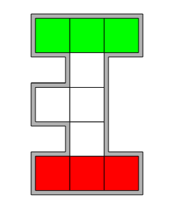

# 1.32. Feladat

- Egy táblán, ami az ábrán látható, tíz mezőből áll, amelyek közül három zöld és három piros mozgatható elemet helyezünk el (a fehér színű mezők üresek). 
- Bármelyik színű elemet lehet elmozdítani egy szomszédos üres mezőre. 
- Cseréljük meg a piros és zöld elemeket.

    

### Az Általam Használt Technológiák és Eszközök

    
    
    
    
    

